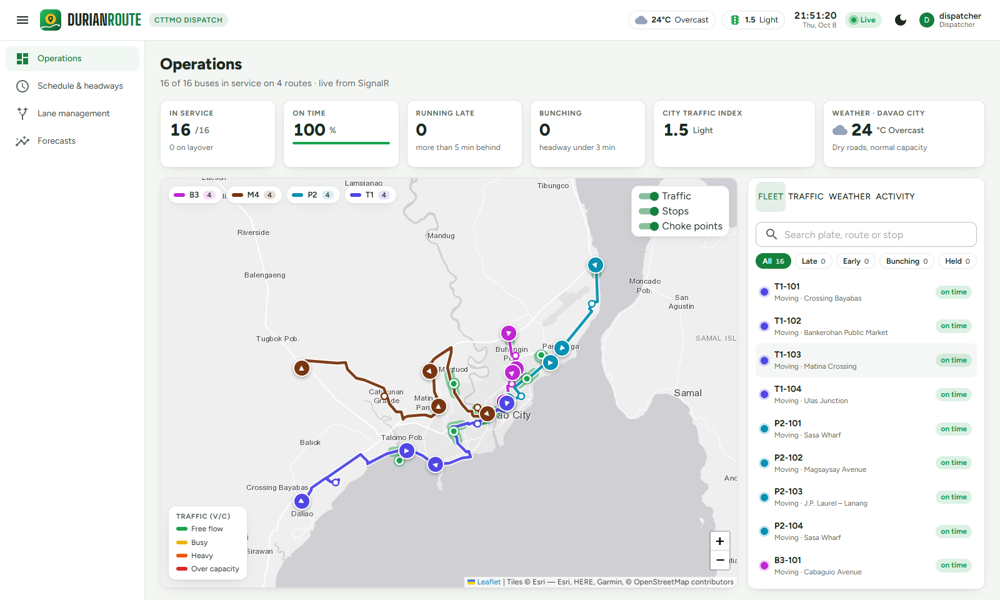
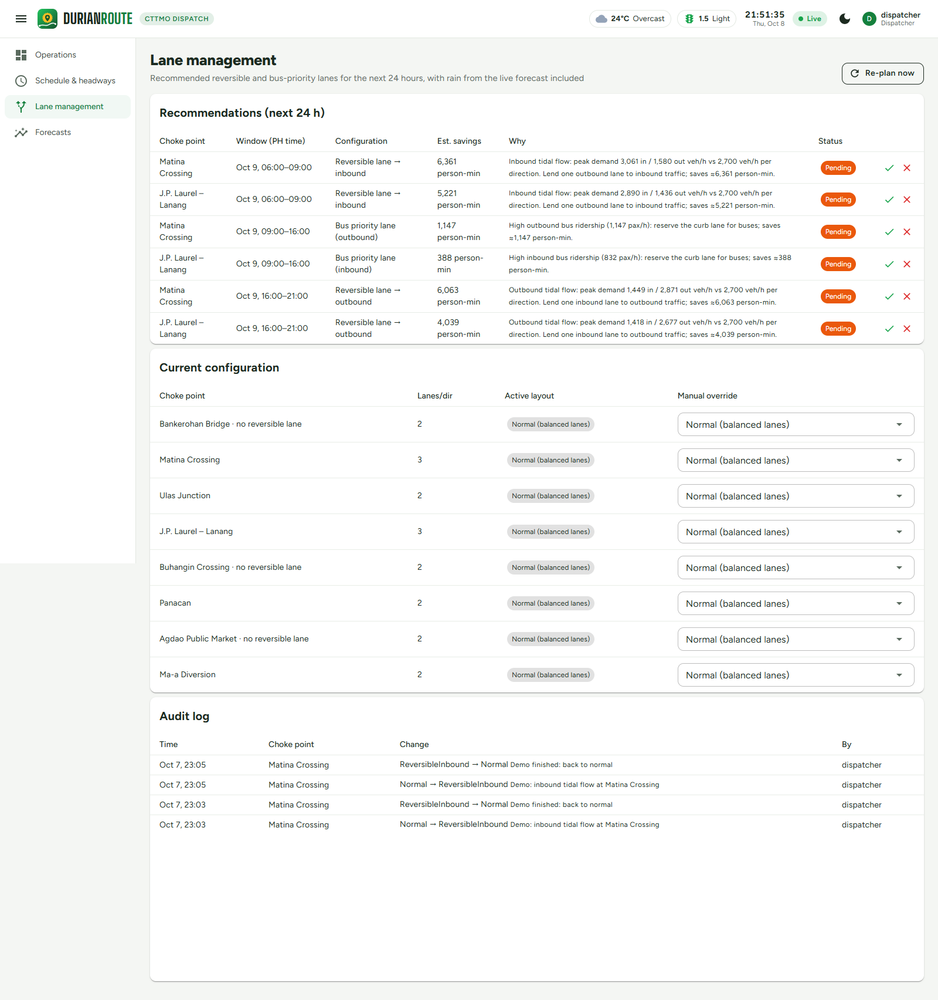
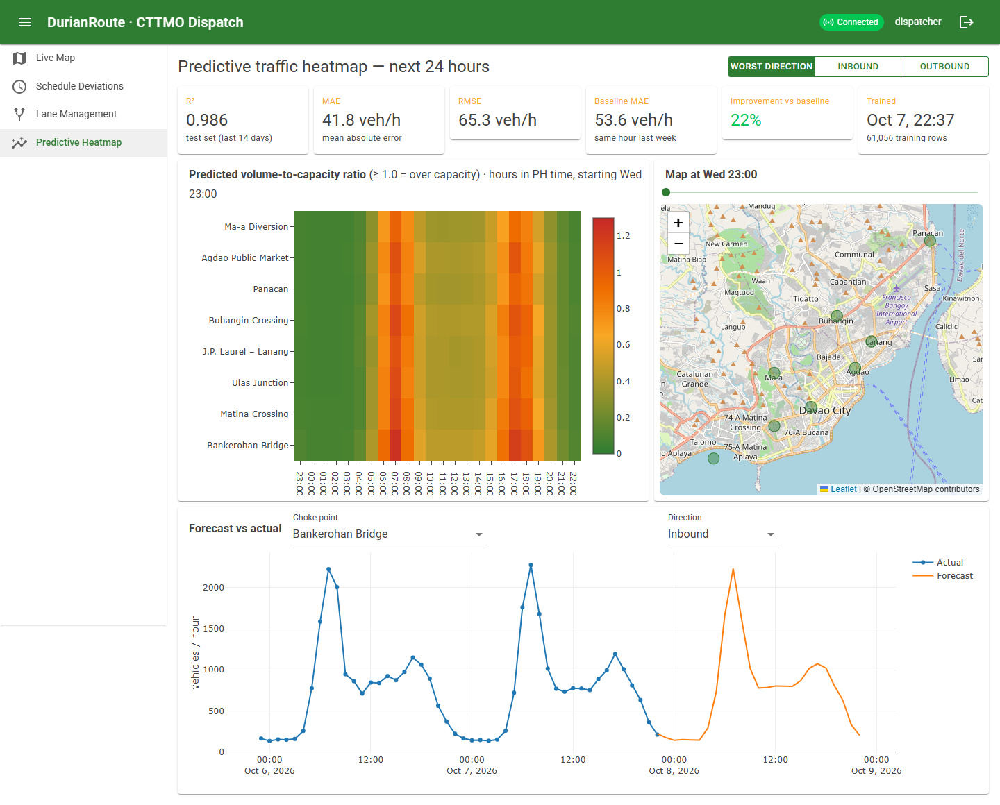

# DurianRoute — Portfolio Case Study

**AI traffic optimization and real-time bus telemetry for Davao City**

Full-stack .NET · Machine learning · Real-time systems · Algorithm design

## The problem

Davao City's main corridors (Matina Crossing, Bankerohan, J.P. Laurel–Lanang, Ulas) jam in one direction at a time: inbound in the morning, outbound in the evening. Traffic managers react to congestion after it forms, and the lanes running the other way sit half empty. Bus dispatchers also have little visibility into which units are running late or bunching.

## What I built

A dispatch system for the City Transport and Traffic Management Office (CTTMO) that answers three questions:

1. **Where are the buses right now?** Live positions stream to a map every second along real Davao roads. Late, early and bunched buses are flagged automatically, and live weather shows how rain is affecting the roads.
2. **Where will traffic jam tomorrow?** A machine-learning model forecasts congestion at each choke point 24 hours in advance.
3. **What should we do about it?** An optimization algorithm recommends when to open a reversible lane or a bus-priority lane. An admin approves or rejects each recommendation, dispatchers can request changes for the admin to decide, and every change is logged.

## Highlights

**Forecasting that beats a strong baseline.**
The ML.NET gradient-boosted tree model scores R² = 0.986 on a two-week holdout. Its error is 22% lower than the "same hour last week" baseline that traffic offices commonly use. The holdout is the most recent data, not a random sample, so the model is never tested on data from the period it was trained on.

**An algorithm I can prove is optimal.**
Lane scheduling is modeled as a shortest-path problem over hours × lane layouts and solved with dynamic programming. The cost of each layout is real commuter delay, using the Bureau of Public Roads formula used in traffic engineering. A unit test checks the algorithm against brute force over every possible plan. The resulting plan matches the city's tidal pattern: reversible lane inbound 6–9 AM, a bus-priority lane at midday, and reversible lane outbound in the evening.

**Real-time, two-way communication.**
SignalR pushes bus positions, congestion levels and lane changes to every dashboard without page reloads. Dispatchers send commands back the same way, for example holding a bus to fix bunching. Each dashboard can choose which routes it receives.

**Tests that caught a real modeling gap.**
The test suite (now 71 tests) showed that the first version of the cost model would leave a reversible lane deployed all night, because nothing in the model said that staffing it costs anything. Adding an hourly operating cost fixed it, and there's now a test for that behavior.

**Secure by default.**
- Admin and Dispatcher roles with an approval workflow: dispatchers request lane changes, only the admin approves them. Enforced on the API and the real-time hub.
- Hashed passwords and a rate-limited login endpoint.
- Database credentials kept out of source control.
- An audit trail of every lane change.

## Screens

| Lane management | Predictive heatmap |
|---|---|
|  |  |

## Tech

C# / .NET 10 · ASP.NET Core Web API · SignalR · ML.NET · Entity Framework Core · SQL Server / SQLite · Blazor WebAssembly · MudBlazor · Leaflet · Plotly · xUnit · OSRM · Open-Meteo

## Honest scope

Traffic and bus data are simulated from realistic Davao patterns, because real CTTMO counts weren't available. The system is built so that real data can replace the simulation without changing the model or the dashboard. The cost-model parameters, such as the cost of switching lanes, are documented assumptions to calibrate with CTTMO.

---

Source and setup instructions: [README.md](README.md)
