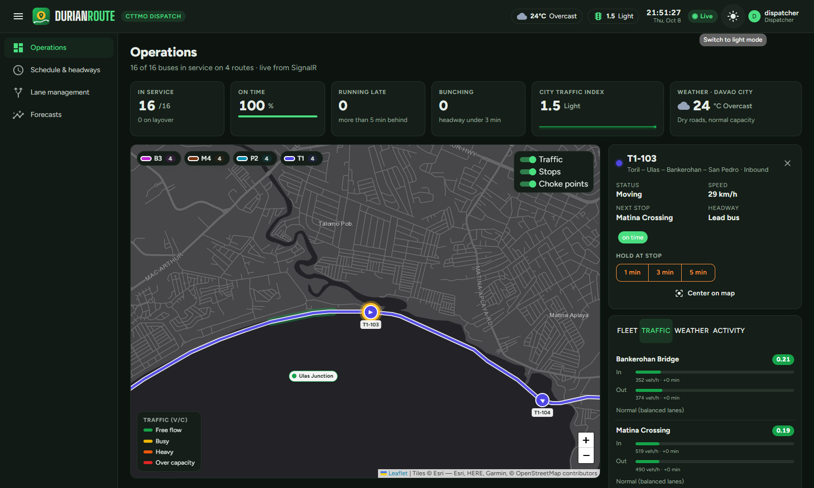
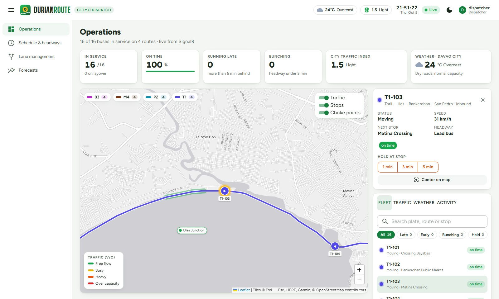
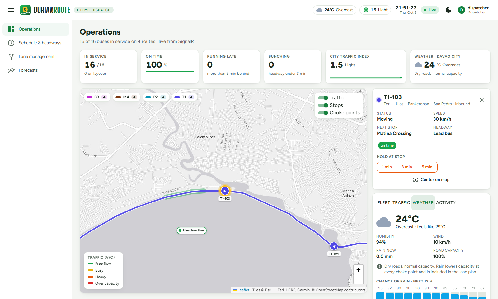
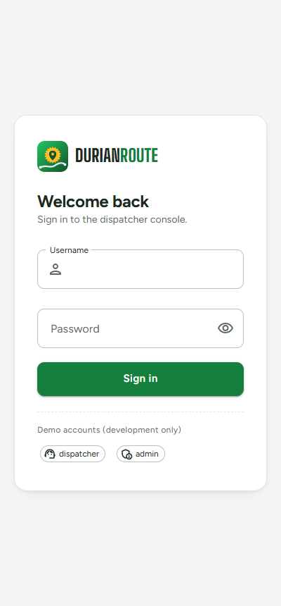

# DurianRoute

**AI traffic optimization and real-time bus telemetry for Davao City.**

DurianRoute is a dispatch dashboard for the City Transport and Traffic Management Office (CTTMO). It tracks public utility buses live, forecasts congestion at major choke points 24 hours ahead with ML.NET, and recommends reversible-lane and bus-priority-lane schedules that a dispatcher approves or rejects.


**Portfolio case study:** [docs/index.html](docs/index.html). It's a standalone page; open it in a browser, or enable GitHub Pages (Settings → Pages → branch `main`, folder `/docs`) to publish it.

> **Data note:** traffic volumes and bus movements are simulated. They follow Davao commuter patterns (inbound AM peak, outbound PM peak, weekends, holidays and Kadayawan, paydays, afternoon rain), and the code is built to take real CTTMO counts in their place. Stop and choke point coordinates are approximate. Weather is real: live Davao City conditions from Open-Meteo.

## Features

| Objective | What it does | Where |
|---|---|---|
| Real-time telemetry | SignalR streams bus positions every second, grouped per route. Buses drive along real Davao roads (OpenStreetMap routing via OSRM), and each bus reports its headway to the bus ahead so bunching is flagged. Dispatchers can hold and release buses from the map. | `DurianRoute.Api/Hubs`, `DurianRoute.Api/Simulation` |
| Predictive analytics | An ML.NET FastTree regression forecasts hourly vehicle volume per choke point and direction, 24 hours ahead. | `DurianRoute.Api/Forecasting` |
| Lane scheduling | Dynamic programming picks the lane layout for each hour that minimizes total person-minutes of delay. Forecast rain lowers road capacity in the plan. Dispatchers can request changes; the admin approves or rejects everything. | `DurianRoute.Api/Scheduling` |
| Live weather | Current Davao weather and a 24-hour outlook from Open-Meteo (free, no key). Rain cuts choke point capacity by 8–25% and slows buses. | `DurianRoute.Api/Weather` |
| Dispatcher dashboard | Blazor WebAssembly + MudBlazor console: an Operations page with KPIs, a live map with a congestion layer and route filters, a fleet panel with search and bunching/late filters, weather, and an activity feed; plus schedule and headways, lane management and forecasts. Light and dark themes, JWT login and role-based access. | `DurianRoute.Client` |

## Results

Model evaluated on a 14-day time-based holdout:

| Metric | Model | Baseline (same hour last week) |
|---|---|---|
| R² | **0.986** | – |
| MAE (vehicles/hour) | **41.8** | 53.6 |
| RMSE (vehicles/hour) | **65.3** | 86.3 |

That is about 22% lower MAE than the baseline.

Example lane plan for a weekday (PH time):

| Choke point | 06:00–09:00 | 09:00–16:00 | 16:00–21:00 |
|---|---|---|---|
| Matina Crossing | Reversible lane → inbound | Bus priority lane (outbound) | Reversible lane → outbound |
| J.P. Laurel – Lanang | Reversible lane → inbound | Bus priority lane (inbound) | Reversible lane → outbound |

## How the lane scheduler works

Each choke point has up to five layouts: normal, reversible inbound/outbound, and bus lane inbound/outbound. For every hour in the next 24, the cost of a layout is the total delay experienced by commuters:

```
cost(hour, layout) = Σ directions [ cars · occupancy · carDelay + busPassengers · busDelay ]
                   + operatingCost · [layout ≠ normal]

carDelay = t0 · 0.15 · (v/c)^4                                        (BPR link-performance function)
busDelay = bus lane ? t0 · 0.1 : carDelay + t0 · friction · min(v/c, 1.5)
```

A dynamic program over the hours × layouts trellis finds the cheapest sequence, and charges a switching cost every time the layout changes:

```
best(k, s) = cost(k, s) + min over p [ best(k−1, p) + switchCost · [p ≠ s] ]
```

This runs in O(hours · layouts²). A unit test checks the result against brute force over every possible plan. Hours a dispatcher has already approved are locked, and rejected options are excluded. Every 15 minutes the plan is recomputed, with the forecast corrected by live conditions.

All cost parameters are in `appsettings.json` under `LaneScheduler` and should be calibrated with CTTMO.

## Architecture

```
DurianRoute.Client (Blazor WASM + MudBlazor + Leaflet + Plotly)
        │  REST (JWT)            ▲ SignalR (positions, traffic, weather, alerts, lane changes)
        ▼                        │
DurianRoute.Api (ASP.NET Core)
  ├─ TelemetryHub ─────────── FleetState ◄── BusSimulator (1 s)
  ├─ Controllers              LiveTrafficState ◄── TrafficSimulator (10 s)
  ├─ ForecastWorker (hourly): record history → train ML.NET → forecast 24 h
  ├─ LaneWorker (30 s): apply approved changes, re-plan every 15 min
  ├─ WeatherWorker (10 min): Open-Meteo → road capacity factor
  ├─ RouteShapeService: OSRM road geometry, cached in App_Data
  └─ EF Core → SQLite (default) or SQL Server
DurianRoute.Shared — DTOs used by both sides
DurianRoute.Tests  — xUnit (71 tests)
```

## Getting started

Requirements: [.NET 10 SDK](https://dotnet.microsoft.com/download) and an internet connection on first start (road geometry, weather and map tiles). Without one, routes fall back to straight lines and the weather panel stays empty.

```bash
# terminal 1 — API, simulation, ML (first start takes ~30 s to build history and train)
dotnet run --project DurianRoute.Api --launch-profile http

# terminal 2 — dashboard
dotnet run --project DurianRoute.Client --launch-profile http
```

Open http://localhost:5183 and sign in:

| Role | Username | Password |
|---|---|---|
| Admin | `admin` | `Admin#2026` |
| Dispatcher | `dispatcher` | `Dispatch#2026` |

### Roles

The **admin makes the decisions**; **dispatchers operate and request**. The server enforces every rule, not just the UI.

| Action | Dispatcher | Admin |
|---|---|---|
| Monitor buses, traffic, weather, forecasts | ✅ | ✅ |
| Hold / release a bus (1–5 min bunching fix) | ✅ | ✅ |
| Request a lane change (reason + 1–8 h) | ✅ | – |
| Approve / reject system recommendations and dispatcher requests | – | ✅ |
| Change a lane immediately | – | ✅ |
| Retrain the forecasting model | – | ✅ |

A dispatcher's request waits in the admin's queue and changes nothing until approved. Its window starts when the admin approves it. The admin gets a notification and a badge count for new requests, and the dispatcher is notified of the decision. Every applied change is recorded in the audit log with the admin who approved it.

These are development-only accounts from `appsettings.Development.json`. The JWT signing key in that file is also development-only. Change both before deploying.

Run the tests:

```bash
dotnet test
```

### Using SQL Server instead of SQLite

The default database is SQLite, stored at `DurianRoute.Api/App_Data/durianroute.db`. To use SQL Server, keep the connection string out of source control with user-secrets:

```bash
dotnet user-secrets set "Database:Provider" "SqlServer" --project DurianRoute.Api
dotnet user-secrets set "ConnectionStrings:SqlServer" "Server=127.0.0.1,1433;Database=DurianRoute;User Id=...;Password=...;Encrypt=True;TrustServerCertificate=True" --project DurianRoute.Api
```

The API creates the tables and seed data on first start.

## Screenshots

| | |
|---|---|
|  |  |
|  |  |
|  |  |
|  |  |

## Tech stack

.NET 10 · ASP.NET Core · SignalR · ML.NET (FastTree) · Entity Framework Core (SQLite / SQL Server) · Blazor WebAssembly · MudBlazor · Leaflet · Plotly.Blazor · xUnit

Data services: road routing from [OSRM](https://project-osrm.org/) on OpenStreetMap data, weather from [Open-Meteo](https://open-meteo.com/), base maps from Esri. None of them need an API key.

## Security

- JWT bearer authentication with Admin and Dispatcher roles, enforced on controllers and on hub methods.
- The SignalR hub rejects unauthenticated connections.
- Passwords are hashed with ASP.NET Core Identity's `PasswordHasher`.
- The login endpoint is rate-limited.
- CORS is restricted to the dashboard's origin.
- Every lane change is recorded in an audit log with who made it and why.
